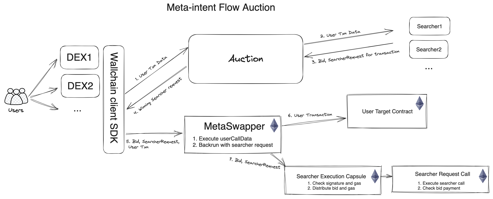

# Meta-intents


We are introducing the first version of the Meta-Intent Flow Auction. It enables seamless capture of the MEV with direct integration into dApps and wallets through the user's transactions and intents.

Along with the intent of the trade or any kind of general DeFi action, the user clearly has a meta-intent. If a transaction creates value for someone else, the sender's Meta-intent is to get as much of that value as possible without diminishing the value of the original transaction. 
To achieve this, Wallchain is gradually building a decentralized, permissionless Meta-Intent Flow Auction.

*Contact https://t.me/wallchain_xyz for onboarding assistance.*

# The flow diagram for the meta-intent flow auction


To start using dApps and wallets need to integrate the Wallchain SDK.

# How it Works
1. dApps send user transaction calldata to the Wallchain Auction Service. Later, the format can be upgraded to signed messages or other intent formats.

2. The Meta-intents auction service broadcasts the user's calldata to the network of searchers.

3. Searchers respond with a `SearcherRequest` and a signature to securely execute that request.

4. The auction service responds with the winning `SearcherRequest`. The winner is the highest bid that passes validation. In most cases there will be no backrunning and the response will be negative.

5. Then the SDK takes the response from The Auction Service and constructs the transaction for MetaSwapper. The latter combines the original user transaction execution and backrunning into a new single transaction.

6. The original user transaction is executed on the target contract. At this moment the user's required condition is satisfied, e.g. the desired asset has reached the user's wallet.

7. The `SearcherRequest` is sent to the `SearcherExecutionCapsule`. The latter performs checks, signature validation, expiration, etc. It also takes the gas prepayment from the searcher. The searcher call is executed in the separate contract `SearcherRequestCall` to try-catch the possible failure and revert in case of not receiving the bid.


# Searcher Protocol Example

After connecting to the websocket endpoint, Searcher will start receiving messages like the following, encoded as json:
```
{
  "jsonrpc": "2.0",
  "method": "user_transaction",
  "params": {
    "lot_id": "be75c90a04f2042ae30d04a96c44460bdd15d5e4",
    "txn": {
      "from": "0xaf418d71576e93d3aa01987ee5ca32d063a3d214",
      "to": "0x10ed43c718714eb63d5aa57b78b54704e256024e",
      "value": 0,
      "input": "0x0"
    },
    "logs": [
      {
        "address": "0xe9e7cea3dedca5984780bafc599bd69add087d56",
        "topics": [
          "0xddf252ad1be2c89b69c2b068fc378daa952ba7f163c4a11628f55a4df523b3ef",
          "0x000000000000000000000000af418d71576e93d3aa01987ee5ca32d063a3d214",
          "0x0000000000000000000000007d9a46ac9cb22a6c4e6a94253c309c0551f717fe"
        ],
        "data": "0x00000000000000000000000000000000000000000000000175f62a9aae607000"
      }
    ]
  }
}
```
Note that this example is truncated, the real transaction has a much larger txn.input and more logs.

To send a bid, the searcher should send the following message to the websocket:
```
{
  "jsonrpc": "2.0",
  "method": "make_bid",
  "id": 26,
  "params": {
    "lot_id": "be75c90a04f2042ae30d04a96c44460bdd15d5e4",
    "searcher_request": {
      "to": "0x0000000000000000000000000000000000000000",
      "gas": 1000000,
      "nonce": 98172209353239903985821686975344235073120637765096460163008503863644315095199, // unordered
      "data": "0x",
      "bid": 1000, // Wrapped Native token wei. WBNB for BNB chain.
      "userСallHash": "0xeb35d19fcc5bfa1bbf8817fe59e2db4157e2b07d66bb526020c04585c8422ef1",
      "maxGasPrice": 10,
      "deadline": 1691748917
    },
    "searcher_signature": "0xccafaf61949ffa086582125a32df26313580f97109273f8ecacb617f710ff2d5129b6717adac0420d2224f4e7e7c77bf56a6aa6a05ae4199808cfdfaa191b4be1b"
  }
}
```
The example of creating a searcher request can be found in Tests.

# What's Next:
- Generalization to support all types of intents, transactions and AA user operations.
- Gasless & private execution by aggregating of private RPCs like MEV-Blocker/MEV-Share/Kolibrio etc.
- Decentralizing Meta-Intent infrastructure using [Gelato](https://www.gelato.network/).
- Sufficient decentralization through deployment on decentralized counterparty discovery networks such as Anoma or SUAVE (or a separate app-chain).
- Distributed Auction Technology based on [Distributed Validator Technology](https://blog.obol.tech/cosmos-dvt-part-1/) and [Distributed Sequencer Technology](https://figmentcapital.medium.com/distributed-sequencer-technology-a-path-to-decentralized-sequencing-549662cc9912).

# License

The primary license for Wallchain Meta-intents is the Business Source License 1.1 (`BUSL-1.1`), see [LICENSE](./LICENSE). Minus the following exceptions:

- [searcher files](./src/searcher/) have a General Public License
- [SearcherBase](./src/SearcherBase.sol) has a General Public License

Each of these files states their license type.
